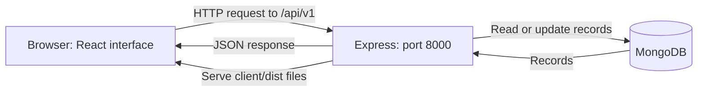

# Forma LMS

A learning management system built with React, Express, and MongoDB. Students can discover and purchase courses, watch lessons, and track progress. Instructors can create courses, upload videos, and publish their work.

**One terminal. One website: http://localhost:8000.** Express serves both the built React frontend and the backend API.


_Screenshot uses isolated sample courses. A new database starts with an empty course library._

## Features

- Course discovery with search, category filters, level filters, and sorting.
- Student registration, cookie-based sign-in, and profile/password settings.
- Saved courses stored locally in the browser, separated by account.
- Stripe Checkout and Razorpay integration with server-side payment verification.
- Purchased-course library, video lessons, and learner-marked progress.
- Instructor studio for course drafts, thumbnails, lesson uploads, and publishing.
- Responsive layouts, keyboard navigation, loading states, and actionable errors.

## Technology

| Layer          | Tools                                                       |
| -------------- | ----------------------------------------------------------- |
| Frontend       | React, React Router, Vite, CSS, Lucide icons                |
| Backend        | Node.js, Express, Mongoose                                  |
| Database       | MongoDB replica set or MongoDB Atlas                        |
| Authentication | JWT in HttpOnly cookies, bcrypt password hashing            |
| Media          | Cloudinary authenticated video delivery                     |
| Payments       | Stripe and Razorpay                                         |
| Verification   | Node test runner, Vitest, Playwright, axe, ESLint, Prettier |

## Quick start

### 1. Install dependencies

Use **Node.js 24**, or Node.js 22.12+ within the supported Node 22 release line. MongoDB must support transactions: use Atlas or a local replica set.

Open a terminal in the repository root, the folder containing the backend `package.json` and `client/`:

```powershell
cd server-challenge
npm run install:all
```

If your terminal is already in that folder, skip `cd server-challenge`. The install command installs both packages from their lockfiles.

### 2. Configure the backend

For a fresh setup, copy the environment example:

```powershell
Copy-Item env.example .env
```

On macOS/Linux, use `cp env.example .env`. Keep an existing configured `.env` rather than replacing it.

Edit `.env` with your own values:

| Variable                                                               | What to configure                                                    |
| ---------------------------------------------------------------------- | -------------------------------------------------------------------- |
| `NODE_ENV`                                                             | `development` locally                                                |
| `PORT`                                                                 | `8000`                                                               |
| `CLIENT_URL`                                                           | `http://localhost:8000`, without a trailing slash                    |
| `MONGO_URI`                                                            | Atlas connection string or local replica-set URI                     |
| `JWT_SECRET`                                                           | A random secret of at least 32 characters                            |
| `CLOUDINARY_CLOUD_NAME`, `CLOUDINARY_API_KEY`, `CLOUDINARY_API_SECRET` | Required for real image/video uploads                                |
| `STRIPE_SECRET_KEY`, `STRIPE_WEBHOOK_SECRET`                           | Configure both to enable Stripe                                      |
| `RAZORPAY_KEY_ID`, `RAZORPAY_KEY_SECRET`                               | Configure both to enable Razorpay                                    |
| `RAZORPAY_WEBHOOK_SECRET`                                              | Webhook signing secret; required for enabled Razorpay in production  |
| `TRUST_PROXY_HOPS`                                                     | `0` for direct local connections; exact proxy count when deployed    |
| `MAX_FILE_SIZE`, `UPLOAD_PATH`                                         | Upload limit and temporary upload directory; defaults in the example |

Generate a JWT secret with:

```powershell
node -e "console.log(require('crypto').randomBytes(48).toString('hex'))"
```

The frontend does not need its own `.env` for the default setup. Unconfigured payment providers return an unavailable response. To display only your configured provider, set `VITE_PAYMENT_PROVIDERS` in `client/.env` before building; see [frontend configuration](client/README.md).

Keep secrets in the backend `.env`. Variables beginning with `VITE_` are public browser configuration and must never contain secret keys.

### 3. Prepare the database and start

With MongoDB available and `.env` configured:

```powershell
npm run db:indexes
npm run dev
```

Open **http://localhost:8000**. Keep this terminal running.

`npm run dev` builds React into `client/dist`, then starts Express through nodemon. Backend code changes restart the server automatically. After frontend source changes, stop with Ctrl+C and run `npm run dev` again to rebuild. No separate frontend server is needed.

## How frontend and backend connect



1. Opening `http://localhost:8000` asks Express for the website. Express sends the built HTML, CSS, and JavaScript from `client/dist`.
2. React runs in the browser. When a page needs data, it calls the shared `api()` helper in `client/src/lib/api.js`.
3. That helper uses `fetch()` with a relative `/api/v1` address. For example, `api('/course/published')` requests `http://localhost:8000/api/v1/course/published`.
4. An Express route receives the request. Its controller validates the operation and reads or updates MongoDB through Mongoose.
5. Express sends a JSON response. React uses that response to update the screen.

The browser sends its session cookie with requests using `credentials: 'include'`. The backend verifies the cookie and checks permissions before allowing protected actions. React does not connect directly to MongoDB or hold provider secret keys.

Both the pages and API use the same address, so the normal setup needs no separate Vite proxy. `middleware/frontend.middleware.js` serves the build and returns `index.html` for React page routes such as `/courses`. API routes are handled first; an unknown API address returns a JSON error instead of an HTML page.

Payment enrollment is confirmed by the backend after verification with the provider. A browser success message or redirect alone does not grant access.

## Project structure

```text
server-challenge/
  client/
    src/
      components/       Shared interface components
      pages/            Student and instructor screens
      contexts/         Authentication, saved courses, notifications
      lib/              API requests, checkout, formatting
    tests/              Isolated browser test fixtures
    package.json        Frontend dependencies and commands
  controllers/          Request handlers
  routes/               API endpoints
  models/               MongoDB models
  middleware/           Authentication, validation, frontend serving
  services/             Course access and purchase fulfillment
  scripts/              Database indexes and instructor provisioning
  test/                 Backend regression tests
  docs/                 Payment, media, and deployment guide
  app.js                Express application and route registration
  index.js              Database connection and server startup
  env.example           Configuration template without secrets
  package.json          Root commands and backend dependencies
```

## Create an instructor and publish a course

Register an account through the website. Public registration always creates a student. From a trusted operator terminal, promote that existing account:

```powershell
npm run user:role -- teacher@example.com instructor
```

Sign in again after promotion. Open **Instructor studio**, create a draft with a thumbnail, add video lessons, and publish. Cloudinary must be configured for uploads. Role changes revoke the account's existing sessions.

## Add an external course link

Sign in as an instructor and open **All courses > Add a course** (or **Instructor studio > New course**). Choose **Link to an external course** under **Course location**. Enter the title, category, level, description, and full HTTPS course URL. A thumbnail is optional; the category artwork is used when no image is uploaded. Set **Forma link access price (INR)** to 0 for a free link, or a positive amount to require Razorpay payment. Save the draft and select **Publish course**.

The published listing appears in the course library. Its **Open course website** button opens the provider in a new tab and displays the destination hostname. For a positive Forma access price, visitors must sign in and complete verified Razorpay payment before the API reveals the URL. The fee unlocks the link in Forma only; it does not purchase or unlock the provider course. Provider charges may apply separately. Students must acknowledge this distinction before opening checkout. Owners can preview their own listings without paying. External purchases appear in My learning and return to the course details, not the video player. Progress remains on the provider website. Adding a URL does not import or copy its videos. This gate controls the link in Forma, not access to a public third-party website; users may find or share the destination elsewhere. Course location cannot be changed after creation; create a separate listing if the hosting model changes.

Only instructors can create or publish listings. If your account is a student, use the operator role command above with your registered email, then sign out and back in. External URLs must use HTTPS and cannot include embedded credentials.

The six selected YouTube/Udemy listings are recorded in `scripts/data/external-courses.json`. To import them into another configured database, run `npm run courses:external -- your-registered-email@example.com` from the repository root. This operator command publishes new links for that account and skips URLs already present; it does not change account roles or overwrite existing listings.

## Commands

Run these from the repository root:

| Command               | Purpose                                                |
| --------------------- | ------------------------------------------------------ |
| `npm run install:all` | Install backend and frontend dependencies              |
| `npm run dev`         | Build React and run the complete website locally       |
| `npm run build`       | Create the frontend production build                   |
| `npm start`           | Run Express with the existing frontend build           |
| `npm run db:indexes`  | Create and verify required database indexes            |
| `npm test`            | Run backend and frontend-serving regression tests      |
| `npm run test:client` | Run frontend unit tests                                |
| `npm run test:e2e`    | Run isolated browser tests                             |
| `npm run check`       | Run backend tests, frontend lint/unit tests, and build |

Optional separate-server development with Vite hot reload is described in [client/README.md](client/README.md). It is not required for the one-command setup above.

## Testing

```powershell
npm run check
npm run test:e2e
```

Backend tests use a temporary MongoDB replica set and mocked payment calls. The first run may download a MongoDB binary. Browser tests use in-memory fixtures on ports 5174 and 18000; they do not create accounts or payments in your database. Windows browser tests use Microsoft Edge. On Linux, install Chromium first with `cd client` followed by `npx playwright install --with-deps chromium`.

GitHub Actions checks the backend on Node 22 and 24 and checks the frontend, browser tests, build, and dependency audits. Automated checks do not replace real provider sandbox payments and signed-video playback verification before launch.

## Deploy to Vercel

The repository includes `vercel.json`. Deploy **the folder containing this README, the backend package.json, and client/** as one Vercel project. Do not deploy `client/` by itself.

1. Push this folder to GitHub after reviewing the staged files (instructions below).
2. In Vercel, select **Add New > Project** and import the repository.
3. Set **Root Directory** to `.` if GitHub contains `package.json` and `client/` at its root. If GitHub contains the parent course repository, choose `server-challenge` instead.
4. Choose **Other** for Framework Preset and **Node.js 24.x**. The committed configuration supplies install command `npm ci && npm --prefix client ci`, build command `npm run build:vercel`, and output directory `client/dist`. Do not use `npm start` as a build command.
5. Add the environment variables below in **Settings > Environment Variables**. Use a stable project domain, for example `https://your-project.vercel.app`, as `CLIENT_URL` with no trailing slash. If the final domain differs, update it and redeploy.
6. Prepare the target Atlas database: on your trusted local machine set `MONGO_URI` to that deployment database and run `npm run db:indexes`. This also adds the shared rate-limit expiry index. Do this before sending traffic; builds never migrate databases automatically.
7. Deploy. Visit `/`, refresh `/courses` directly, and check `/health` returns HTTP 200. Test registration, sign-in, instructor editing, and a Razorpay **test-mode** purchase with a student account.

| Vercel variable | Value |
| --- | --- |
| `NODE_ENV` | `production` |
| `MONGO_URI` | MongoDB Atlas URI for the deployment database |
| `JWT_SECRET` | Your generated random secret, at least 32 characters |
| `CLIENT_URL` | Exact public HTTPS origin, no trailing slash |
| `RAZORPAY_KEY_ID`, `RAZORPAY_KEY_SECRET` | Matching test keys first; matching live keys only after approval |
| `RAZORPAY_WEBHOOK_SECRET` | A separate random secret also configured in the Razorpay webhook dashboard |
| `VITE_PAYMENT_PROVIDERS` | `razorpay` for this setup; this value is public and applied at build time |
| `CLOUDINARY_CLOUD_NAME`, `CLOUDINARY_API_KEY`, `CLOUDINARY_API_SECRET` | Required when uploading thumbnails, avatars, or hosted lessons |
| `STRIPE_SECRET_KEY`, `STRIPE_WEBHOOK_SECRET` | Optional; leave both absent if using only Razorpay |

`PORT` and `UPLOAD_PATH` are unnecessary on Vercel. Vercel's proxy is trusted automatically only in its runtime. Do not set `VITE_API_BASE_URL`: the default `/api/v1` keeps cookies and API calls on the same domain. Never put secret keys in `VITE_` variables or GitHub files. Changing build-time variables requires a redeployment.

Atlas must allow network access from your deployment. Use the networking options available for your Vercel plan and a database user restricted to this application database. Keep preview deployments on a separate test database with test payment keys and their own exact `CLIENT_URL`; a production origin does not authorize a different preview origin.

### How the Vercel deployment works

Vercel serves the React build as static files. `/api/*` and `/health` route to `api/index.js`, which validates configuration, reuses one MongoDB connection pool per function instance, and invokes Express without opening a port. Other page routes fall back to the React entry through Express. Payment webhooks retain their raw request bytes for signature verification. Production rate limits use MongoDB so separate instances share counters.

**Upload limit:** Vercel Functions accept requests up to 4.5 MB. This deployment caps each file at **4,000,000 bytes** in both frontend and backend, leaving room for multipart fields. Temporary files use the operating system temporary directory and are deleted after requests; Cloudinary stores the uploaded media. External course listings need no video upload. For larger hosted videos, use the included Docker/Node deployment or implement authenticated direct-to-Cloudinary uploads before offering large lesson uploads. Increasing `MAX_FILE_SIZE` cannot bypass Vercel's platform limit.

See [Vercel function limits](https://vercel.com/docs/functions/limitations) and [Vercel project configuration](https://vercel.com/docs/project-configuration/vercel-json).

### Enable Razorpay payments

A deployment URL alone does not enable checkout. The backend returns HTTP 503 when Razorpay credentials are absent. Test and live modes use different key pairs.

1. In Razorpay, switch to **Test mode**, generate the API key pair, and configure both keys in Vercel.
2. Configure webhook URL `https://your-project.vercel.app/api/v1/razorpay/webhook`, subscribe to **payment.captured**, and use the same signing secret as `RAZORPAY_WEBHOOK_SECRET`. The public production endpoint must be reachable without Vercel deployment-protection authentication.
3. Configure automatic capture and complete a test purchase as a student. Payment access is granted only after captured-payment verification or a valid captured-payment webhook, not from the browser success screen alone.
4. Confirm payment in the Razorpay test dashboard, refresh the purchased course, and verify that another student cannot open its paid link without purchasing.
5. Submit the deployed website for Razorpay review. Publish accurate business/contact information and your actual terms, privacy, and cancellation/refund policies before requesting live approval. This repository does not invent those business policies or guarantee provider approval.
6. After approval, replace test keys with live keys and configure the corresponding live-mode webhook. Redeploy, then perform a controlled live acceptance check.

For external courses, the Forma fee buys **link access only**. It does not purchase a Udemy or other provider subscription/course; the checkout explicitly discloses this. Confirm that your actual offering is acceptable to your payment provider before taking live payments.

References: [Razorpay API authentication](https://razorpay.com/docs/api/authentication/) and [test/live modes](https://razorpay.com/docs/payments/dashboard/test-live-modes/).

### Troubleshooting deployment

| Symptom | Check |
| --- | --- |
| Checkout says unavailable | Both Razorpay keys must exist; inspect Vercel function logs for configuration/network errors. Deployment by itself does not fix missing keys. |
| `/health` returns 503 | Atlas network access, credentials, replica-set support, and `npm run db:indexes` against the correct database. |
| Sign-in returns origin error | `CLIENT_URL` must exactly match the browser origin. Update it after changing domains and redeploy. |
| Course route returns 404 on refresh | Import the complete project root and retain the committed routing configuration. |
| Upload rejected | Keep files below 4 MB on Vercel; configure all Cloudinary credentials. |
| Payment captured but access missing | Check webhook delivery/signing secret and use the payment verification flow; do not manually mark unverified purchases complete. |

### Docker or a persistent Node host

For larger upload requests, the same application can run on a persistent Node host:

```sh
npm run install:all
npm run build
npm run db:indexes
npm start
```

Use production environment variables, HTTPS, and the exact public `CLIENT_URL`. Configure `TRUST_PROXY_HOPS` for the host's actual proxy chain. The included Dockerfile builds both packages: `docker build -t forma-lms .`. Serve TLS through your host or reverse proxy. See [operations and migrations](docs/OPERATIONS.md).

## Current limitations

- Saved courses are browser-local and do not synchronize across devices.
- Completion is marked by the learner; watching a video is not independently certified.
- Email password recovery, certificates, free enrollment, and automated refunds/dispute reconciliation are not implemented.
- A provider-dashboard refund does not automatically revoke course access.
- Production rate limits share MongoDB counters; development limits are per process.
- Vercel uploads are capped at 4 MB per file; large hosted-video uploads require another deployment/upload path.
- Live payment acceptance, business policies, provider approval, backups, and production monitoring must be completed for your own deployment.

## Version control

Commit source files, both `package-lock.json` files, and environment examples. The ignore rules exclude `.env`, dependencies, uploaded files, build output, Vercel local metadata, and test reports.

```powershell
git status --short
git add .
git --no-pager diff --cached --stat
git --no-pager diff --cached
git commit -m "Prepare Forma LMS for Vercel deployment"
git push
```

Review staged changes before committing. Use your configured remote and branch, and never force-add secret files.
